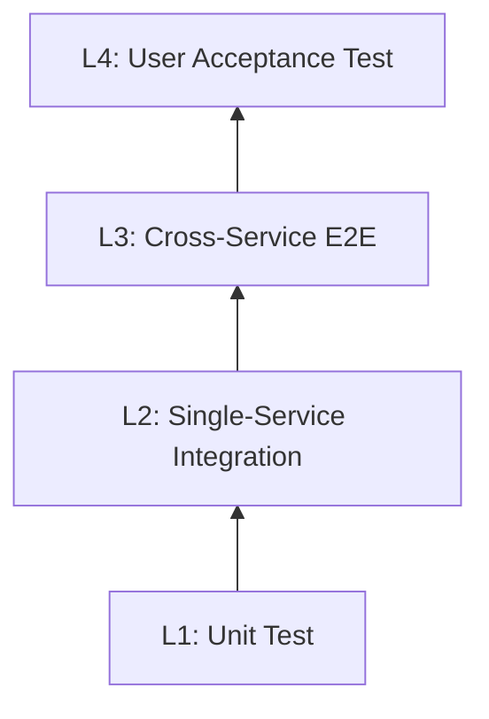

# Universal Layered Testing Strategy

## Description

This Skill generates a complete layered testing strategy based on project type (Backend+APP / Backend+WEB / Backend+APP+Embedded), including test layer architecture, scenario adaptation matrices, code templates, and CI/CD configuration.

Core philosophy: **"Quality is built in, not tested in."**

### Two Key Principles

1. **Shift Left**: Developers write L1/L2 tests during coding — the earlier bugs are found, the lower the fix cost
2. **Push Down**: If it can be tested at L1, don't leave it for L2; if it can be tested at L2, don't leave it for L3

### Ideal Test Pyramid Proportions

- **L1 (Unit)**: ~70% — Millisecond feedback (includes interface contract / schema contract)
- **L2 (Integration)**: ~20% — Minute-level feedback (single service + real middleware)
- **L3 (E2E)**: ~10% — Hour-level feedback (cross-service full chain, including third-party APIs)
  - **L3-k8s**: L3 sub-layer, requires K8s/minikube environment
- **L4 (UAT)**: <1% — Staging acceptance

## Rules

1. **Layering must be complete**: Every project must define the test scope and tools for each L1-L4 layer
2. **Coverage gates**: L1 coverage ≥ 80%, core logic libraries ≥ 90%
3. **Mock isolation**: L1 tests must mock all external dependencies (DB/network/HAL/filesystem)
4. **Test case ID convention**: All cases follow the `L{layer}-<MODULE>-NNN` format
5. **TDD debugging**: Bug fixes must start with a reproduction test case — manual browser debugging is prohibited
6. **CI quality gates**: L1 + L2-1 must pass 100% on every commit
7. **Requirements traceability**: A User Story → Test Case traceability matrix must be established
8. **L3/L4 black-box testing**: L3 and L4 must be end-to-end black-box tests — the test client (Playwright/Appium/real device) interacts directly with the user interface. **Intercepting, mocking, or bypassing any internal component at intermediate layers is prohibited**. The only exception is uncontrollable external third-party services, which may use stub replacements
9. **Test scenario data management**: Each test scenario must be loadable via `make mock-scenario` or equivalent commands for controlled, repeatable input

---

## Step 1: Identify Project Type

Ask or auto-detect which scenario the project belongs to and determine the tech stack:

| Scenario                | Typical Tech Stack                        | Special Focus                                    |
| :------------------ | :-------------------------------- | :------------------------------------------ |
| **Backend+APP**        | Go/Java + Flutter/RN              | App UI testing, API contracts, push notifications |
| **Backend+WEB**        | Go/Java + React/Vue               | Browser compatibility, SEO, SSR              |
| **Backend+APP+Embedded** | Go/Java + Flutter + C/C++ (Bazel) | HAL abstraction, Wasm simulation, Digital Twin, Software Update |

---

## Step 2: Generate Layered Test Architecture

### 2.1 Universal Four-Layer Architecture (L1-L4)



### 2.2 L1 — Unit Test

**Goal**: Verify the logical correctness of the smallest code unit (function/class/state machine). **Includes interface contract and schema contract** (validation without I/O dependencies).

| Project Type          | Test Target                       | Tools                    | Focus                       |
| :---------------- | :----------------------------- | :---------------------- | :--------------------------- |
| **Backend**          | Service/Repository/Domain logic + API Schema | Go Test / JUnit / pytest | Business rules, boundary conditions, interface contracts |
| **APP (Flutter)** | Widget/BLoC/Provider logic      | flutter_test            | State management, data transformation |
| **APP (RN)**      | Component/Hook logic            | Jest                    | State management, data transformation |
| **WEB**           | Components/Hooks/Store         | Vitest / Jest           | Rendering logic, state management |
| **Embedded**        | Cluster logic, FSM, algorithms        | GTest + Mock HAL        | State transitions, HAL interactions, memory safety |

**L1 Writing Standards**:

- Mock all external dependencies (DB/network/HAL/filesystem)
- Cover: normal path / boundary conditions / error handling / state transitions
- Target coverage ≥ 80% (core logic libraries ≥ 90%)
- Millisecond execution as real-time development feedback
- L1 does not need to be listed case-by-case in the test plan document (co-located with code, pytest auto-discovers)

### 2.3 L2 — Single-Service Integration Test

**Goal**: Verify module collaboration within a single service boundary, using real middleware (DB/Redis/MQ/Vault, etc.) but without crossing service boundaries.

| Project Type   | Test Target                 | Tools                            |
| :--------- | :----------------------- | :------------------------------ |
| **Backend**   | Service <-> DB/Redis/Kafka | Docker Compose / Testcontainers |
| **APP**    | App <-> Mock Server        | Integration Test + Mock Server  |
| **WEB**    | Frontend <-> Mock API      | MSW / Vitest                    |
| **Embedded** | Device + HAL (Wasm)      | Vitest Browser (Digital Twin)   |

### 2.4 L3 — Cross-Service E2E (End-to-End)

**Goal**: Verify the complete chain across multiple independent services, including real third-party APIs.

| Project Type            | Test Target                      | Tools                                    |
| :------------------ | :---------------------------- | :-------------------------------------- |
| **Backend+APP**        | App → API → DB → Push         | Appium / Flutter Integration Test       |
| **Backend+WEB**        | Browser → API → DB → SSE      | Playwright / Cypress                    |
| **Backend+APP+Embedded** | App → Cloud → Hub(Wasm) → HAL | Simulator + Vitest Browser + Playwright |

**Black-box principle**: L3 tests are from the user's perspective — the test client (browser/App) → frontend → backend → database full-chain connectivity. **Intercepting or mocking at any intermediate layer is prohibited**. The only exception is uncontrollable real third-party services (e.g., payment gateways), which may use stub services, but internal components must not be mocked.

**L3-k8s sub-layer** (optional): When test scenarios depend on the K8s environment (e.g., Pod scheduling, Spot Recovery), mark as L3-k8s. Use L3 (no K8s) for daily development; use L3-k8s for Nightly/Pre-release.

### 2.5 L4 — User Acceptance Test (UAT)

**L4 is not entirely manual**: Automation is primary; only scenarios requiring real third-party client interaction retain manual testing.

| Type | Design Principle | Execution Method | Scenario Example |
|------|---------|---------|--------|
| **L4-Auto** | Acceptance criteria are quantifiable: has input and expected output | `make test-l4-uat` (automated, Staging environment) | API Roundtrip, Memory persistence, approval workflows |
| **L4-Manual** | Requires real third-party client visual verification | QA manual testing in real environment | Feishu Card UI rendering, message delivery visual check |

- **Owner**: QA team / PM
- **Environment**: Real Staging (real DB/Letta/external services, not Mock)
- **Focus**: User experience, extreme network conditions, real third-party service interaction
- **LLM path**: Assert structure and side effects; do not assert specific LLM output text

### 2.6 Cross-Layer Test Suites: Smoke / Regression / UAT

**These three suites are not new test layers** — they are **run suites** formed by tagging (markers) existing L1-L4 test cases.

| Suite | Meaning | Case Source | Run Command | Timing |
|------|------|-----------|----------|------|
| **Smoke** | Quick validation of the most critical paths (system is alive) | A few key L3 cases tagged with `@smoke` | `make smoke` | Run immediately after deployment |
| **Regression** | Full regression verifying historical features are not broken | All L1+L2+L3 cases | `make regression` | Before PR merge / CI quality gate |
| **UAT-Auto** | Business acceptance automation (Staging real environment) | Quantifiable portion of L4 cases | `make test-l4-uat` | Before release / Release Tag |

**Key principles**:
- Smoke cases = Add `@pytest.mark.smoke` to existing L3 critical-path cases — do not create new test files
- A single case can have multiple markers, e.g., `@pytest.mark.smoke` + `@pytest.mark.l3`
- **Criteria for selecting smoke cases**: The user's most common critical paths, the system's only irreplaceable entry points
- Smoke cases must be **fast** (all pass in < 5 min); otherwise, move them to regular test-l3

```python
# Example: A case belonging to both l3 and smoke
@pytest.mark.l3
@pytest.mark.smoke
async def test_completions_roundtrip(...):
    """L3-COMP-001: The most critical E2E case."""
    ...

# Example: L4 Auto case — Staging environment, does not assert specific text
@pytest.mark.l4
async def test_agent_memory_persists(letta_client):
    """L4-MS-001: Agent remembers user preferences across conversations."""
    archival = await letta_client.archival_memory_search(agent_id, keyword)
    assert len(archival.items) > 0   # Having content is sufficient
```


---

## Step 3: Scenario Adaptation Matrix

Based on project type, determine **required / recommended / optional** for each layer:

### Scenario A: Backend + APP

| Layer                | Status    | Focus                          |
| :------------------ | :------ | :---------------------------- |
| L1 (Unit)           | Required | Backend business logic + App state management   |
| L2-1 (Interface)    | Required | API contracts (OpenAPI/Protobuf)   |
| L2-2 (Integration)  | Required | Backend service + DB/MQ integration |
| L2-3 (E2E)          | Required | App → API full chain              |
| L2-4 (Playground)   | Recommended | Swagger UI + Mock environment        |
| L3-1 (Contract)     | Recommended | Frontend-backend API contracts               |
| L3-2 (Cross-System) | Optional | Multi-subsystem coordination                  |
| L4 (UAT)            | Required | Real device testing + App Store review process |

**Special focus areas**:

- End-to-end push notification verification (APNs/FCM)
- Multi-device login / token refresh race conditions
- App cold start / warm start performance
- Offline mode & data sync

### Scenario B: Backend + WEB

| Layer                | Status    | Focus                              |
| :------------------ | :------ | :-------------------------------- |
| L1 (Unit)           | Required | Backend business logic + Frontend components/Store     |
| L2-1 (Interface)    | Required | API contracts + Component Props interface        |
| L2-2 (Integration)  | Required | Backend service integration + Frontend API layer        |
| L2-3 (E2E)          | Required | Browser → API full chain (Playwright) |
| L2-4 (Playground)   | Recommended | Storybook + Staging environment          |
| L3-1 (Contract)     | Recommended | Frontend-backend API change compatibility             |
| L3-2 (Cross-System) | Optional | Multi-subsystem coordination                      |
| L4 (UAT)            | Recommended | Real browser testing                    |

**Special focus areas**:

- Browser compatibility (Chrome/Firefox/Safari)
- Responsive layout (Mobile/Tablet/Desktop)
- SSR/SSG hydration consistency
- Accessibility (a11y)
- SEO verification

### Scenario C: Backend + APP + Embedded

| Layer                | Status    | Focus                                       |
| :------------------ | :------ | :----------------------------------------- |
| L1 (Unit)           | Required | Backend + App + Cluster/FSM/algorithms              |
| L2-1 (Interface)    | Required | API contracts + C ABI + AxData protocol             |
| L2-2 (Integration)  | Required | Backend integration + Device Wasm integration (Digital Twin) |
| L2-3 (E2E)          | Required | App → Cloud → Hub(Wasm) → HAL full chain       |
| L2-4 (Playground)   | Required | Web Simulator                     |
| L3-1 (Contract)     | Required | Device/cloud/edge protocol contracts                           |
| L3-2 (Cross-System) | Recommended | Multi-subsystem coordination (Security <-> AI <-> Push)                |
| L4 (UAT)            | Required | Real hardware + Real App + Real cloud             |

**Special focus areas**:

- **HAL abstraction**: All hardware operations through HAL interfaces, Bazel `select` switches at build time
- **Wasm simulation fidelity**: Digital Twin behavioral consistency with real hardware
- **Memory safety**: ASan/TSan/Valgrind verification (resource-constrained platforms)
- **Software Update**: Version upgrade/downgrade/interrupted recovery verification
- **Network disruption resilience**: Local autonomy capability when nodes are offline
- **D2D communication**: Device-to-device direct interaction verification

---

## Step 4: Generate Test Plan Documentation

### Document Directory Structure

```
docs/testing/
├── strategy.md                   # Test plan overview (SSOT, ≤400 lines)
└── scenarios/                    # Scenario matrices (split when strategy.md is too long)
    ├── ep1-<epic-name>.md        # By Epic (product perspective): User Story → AC scenario traceability
    ├── ep2-<epic-name>.md
    ├── tech-<module>.md          # By technical module (developer perspective): service/component traceability
    └── tech-nfr.md               # NFR degradation/fault tolerance
```

> Epic files are for product/QA audiences (organized by User Story); technical files are for developers (organized by module). **Both file types share the same set of case IDs** for bidirectional traceability.

### strategy.md Template

```markdown
# <Project Name> Test Plan

## 1. Test Layer Overview

| Layer | Case Count | Test Goal | Real Dependencies | Mock Dependencies | Real Infra | Mock Infra | Execution Timing | Duration | Code Location |
|------|-------|---------|---------|----------|-----------|-----------|---------|------|---------|

> 10-column standard table — real dependencies vs mock dependencies is the core decision basis for layering.

### 1.1 Layering Logic

| Layer | Core Problem Solved | Why the Layer Above Is Insufficient |
|------|-------------|--------------|

> L2 vs L3 boundary: L2 = single application, no external dependencies (all mocked); L3 = real dependency integration.

### 1.2 Shift-Left Principle

| Verification Point | First Appearing Layer | Notes |
|--------|-------------|------|

Prohibited anti-patterns:
- No verifying logic at L3 that should be covered at L1
- No omitting L3 User Story AC cases just because "L1/L2 already tested it"

## 2. Mock Infrastructure (SSOT)

Mock infrastructure is managed by the `mock-engine` skill (start/stop mock services, load test data, create test scenarios).

[mock directory structure + WireMock per-layer switching strategy table]

| External System | L2 Handling | L3 Handling |
|---------|-----------|-----------|

## 3. L2 Integration Tests

> L1 unit tests co-exist with code and are not listed case-by-case in this plan.

Detailed cases in [scenarios/tech-<module>.md].

## 4. L3 E2E Tests (Black-Box)

> Test client interacts through the user interface — **no intermediate layer interception**.

Detailed cases in [scenarios/ep*.md] (by User Story) and [scenarios/tech-*.md] (by module).

## 5. L4 Acceptance Criteria

| Acceptance Item | User Story | Execution Method | Pass Criteria |
|--------|----|---------|----|

## 6. Requirements Traceability Matrix

| User Story | L1 | L2-1 | L2-2 | L3-1 | L3-2 | L4 |
|------------|----|------|------|------|------|-----|

> Each column is filled with specific case IDs. L1 lists covered logic points (co-exists with code, no case IDs).

## 7. Test Scenario Data

| Scenario Name | Purpose | DB Initial State | Covered Cases |
|--------------|------|-----------|---------|

> Each Scenario = DB seed data + Mock stub configuration. Switch with `make mock-scenario SCENARIO=<name>`.

## 8. CI/CD Automation Pipeline + Quality Gates

| Gate | Checkpoint | Criteria |
|------|-------|------|
```

### Scenario File Template (scenarios/*.md)

Epic files and technical files share the **AC-level traceability table**:

```markdown
## US-TP-01 Device Card Badge

| AC Scenario | Smoke | L1 | L2-1 | L2-2 | L3-1 | L3-2 | L4 |
|---------|-------|----|------|------|------|------|-----|
| Show locked badge when unsubscribed | fire | TestClass | CONTRACT-001 | EVAL-001 | FG01-001 | TP01-001 | pass |
```

> Fixed 8 columns. Each cell is filled with a **specific case ID**; use `-` when not covered. fire = smoke case.
> **Complete real-world example**: See `references/engagement-example.md` (includes directory structure, table format, mock architecture, semantics annotation conventions, etc.).

---

## Step 5: Write Test Code

### 5.1 Test Case ID Convention

- L1: `L1-<MODULE>-NNN` (e.g., `L1-AUTH-001`)
- L2: `L2-<MODULE>-NNN` (e.g., `L2-CRED-001`)
- L3: `L3-<FLOW>-NNN` (e.g., `L3-COMP-001`)
- L3-k8s: `L3k8s-<FLOW>-NNN`
- L4: `L4-<FLOW>-NNN`

### 5.2 Universal Test Templates

Code templates for each tech stack are in **`references/code-templates.md`** (Go / Java / Flutter / React / C++ / Playwright / Flutter Web+Playwright / Wasm Digital Twin).

### 5.3 Key Test Patterns

#### Promise Resolver Pattern (Async Verification)

```typescript
// Correct: event-driven
await waitFor(() => shadowUpdates.get("panel_status") === "armed_away");

// Wrong: never use setTimeout
await new Promise((resolve) => setTimeout(resolve, 3000));
```

> Embedded-specific patterns (State-Wait, Forced Cycle) are in `references/code-templates.md`.

#### Test Scenario Data Management

Switch preset test data states via `make mock-scenario` for controlled, repeatable test input:

```bash
make mock-scenario SCENARIO=new-user        # No history
make mock-scenario SCENARIO=returning-user   # Has past interaction history
make mock-scenario SCENARIO=converted-user   # Has completed conversion
```

Each Scenario = a set of DB seed data + Mock stub configuration. Playwright tests specify the scenario via URL parameter (`?scenario=new-user`) or environment variable, integrating seamlessly with CI.

#### WireMock Fault Injection

Inject fault scenarios via WireMock to verify service degradation behavior:

```json
// Inject 5s delay → Expected: service degrades and returns HTTP 200 with empty list
{ "request": { "method": "POST", "urlPattern": "/api/eval" },
  "response": { "fixedDelayMilliseconds": 5000, "status": 200 } }

{ "request": { "method": "GET", "urlPattern": "/v1/features/.*" },
  "response": { "status": 500 } }
```

---

## Step 6: CI/CD Automation Configuration

The CI pipeline is organized by test layer into stages: `test-l1` (every commit) → `test-l2` (Nightly/Merge) → `test-e2e` (Release) → `quality` (coverage). The complete `.gitlab-ci.yml` template is in `references/code-templates.md`.

### Quality Gates

| Gate         | Checkpoint             | Criteria                    |
| :----------- | :----------------- | :---------------------- |
| **CI Gate**  | L1                 | 100% pass, coverage ≥ 80% |
| **Nightly**  | L2 + L3            | 100% pass               |
| **Release**  | L1 + L2 + L3 + L4  | 100% pass               |
| **Memory Safety** | ASan/TSan (Embedded) | 0 errors                  |
| **Code Quality** | SonarQube          | Quality Gate pass       |

---

## Step 7: TDD Debugging Workflow

> **Manual browser debugging is prohibited** — bugs must be reproduced and verified through test cases

### 1. Reproduce (Red)

Select the test tool based on bug layer:

| Bug Type     | Test Layer | Tools                          |
| :----------- | :------- | :---------------------------- |
| Backend business logic | L1       | Go Test / JUnit / GTest       |
| API interface     | L2-1     | Interface test + Mock               |
| Frontend component     | L1       | Vitest / Jest / flutter_test  |
| Frontend-backend integration   | L2-2     | Docker Compose + Integration  |
| Full chain       | L2-3     | Playwright / Simulator        |
| Embedded logic   | L1       | GTest + Mock HAL              |
| Wasm/Browser | L2-2     | Vitest Browser (Digital Twin) |

Write a reproduction test → run to confirm it **fails**

### 2. Fix (Green)

Analyze test logs → fix code → run to confirm it **passes**

### 3. Verify (Refactor)

Run the full test suite to confirm no regressions; retain the test case as regression protection.

---

## Examples

### Bad — Test strategy missing layering

```yaml
stages: [build, test]
test:
  script: [go test ./..., flutter test, npm run test]
# Problem: no layering, no gates, L1 failures cannot be quickly pinpointed
```

### Good — Layered pipeline (complete template in `references/code-templates.md`)

```yaml
stages: [build, test-l1, test-l2, test-e2e, quality]
# Each layer has its own stage, trigger rules, and gates
```

### Bad — Non-standard debugging approach

```typescript
// Manual setTimeout wait — unreliable and fragile
await new Promise((resolve) => setTimeout(resolve, 3000));
console.log("manually check the browser to see if it's working"); // Manual browser debugging prohibited
```

### Good Example — Event-driven async verification

```typescript
// Using Promise Resolver Pattern for precise state change waiting
await waitFor(() => shadowUpdates.get("panel_status") === "armed_away");
expect(shadowUpdates.get("panel_status")).toBe("armed_away");
```

---

## Checklist

- [ ] Project type identified
- [ ] Test layer architecture defined
- [ ] Test plan document generated (`docs/<project>_test_plan.md`)
- [ ] Test case IDs at each layer consistent with the plan
- [ ] L1 covers core logic + boundary conditions
- [ ] L2-1 covers API contracts / ABI interfaces
- [ ] L2-2 covers critical integration paths
- [ ] L2-3 covers core User Story end-to-end paths
- [ ] Requirements traceability matrix established (User Story → Test Case)
- [ ] CI/CD pipeline configured with quality gates
- [ ] All bug fixes have reproduction test cases

## References

- [Quality Assurance and Layered Testing Strategy](https://docs.example.com/wiki/reference)
- [Subsystem Universal Layered Testing Strategy and Practice Guide](https://docs.example.com/wiki/reference)
- [TDD-Driven Development Skill](../tdd/SKILL.md)
